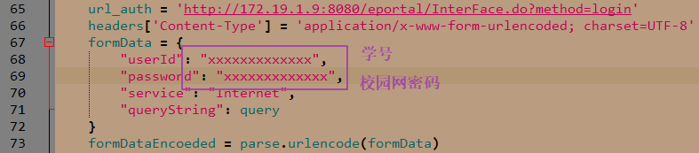
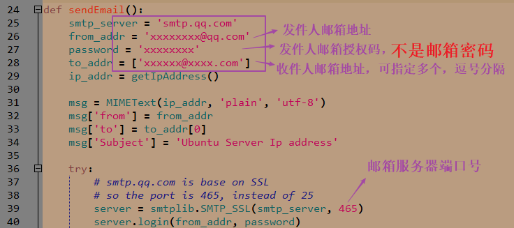
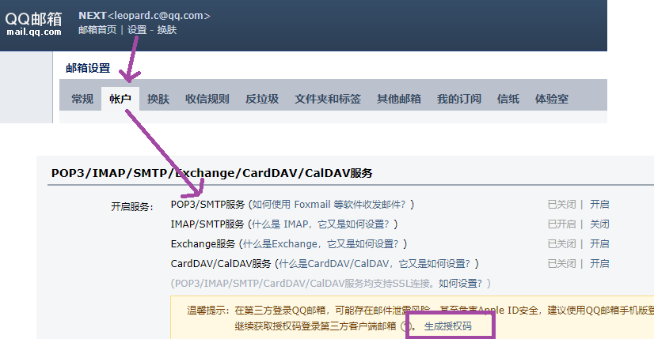
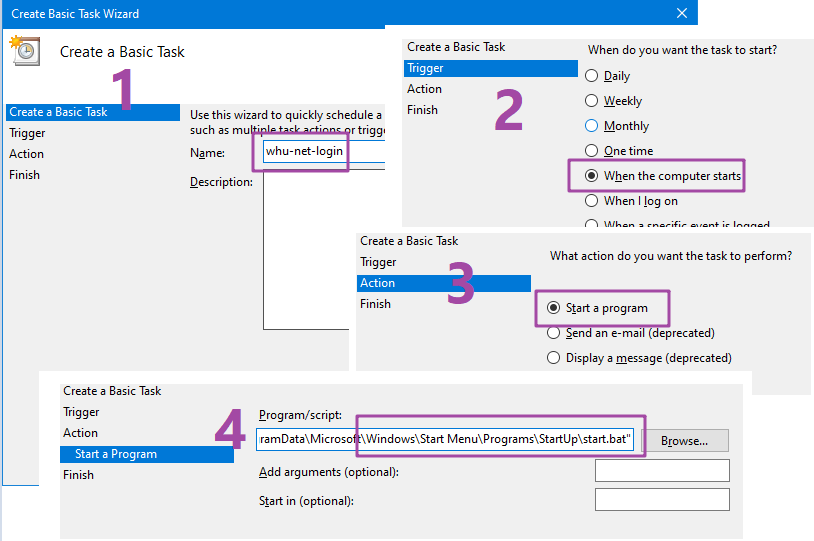
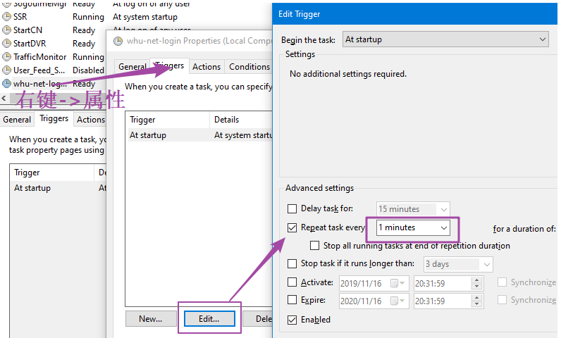

# WHU-Net-AutoLogin
武大校园网自动认证登录脚本，使用Python语言编写。

两个文件（windows，linux，mac均可运行，有Python就行）

+ whu-net-login.py：自动登陆【适合笔记本电脑】
+ whu-net-login-email.py：自动登陆 + 发送ip地址到指定邮箱【适合Linux主机、服务器、树莓派等】

## 如何使用

`whu-net-login.py`修改如下两处



`whu-net-login-email.py`还需**额外**修改



授权码可以通过如下方式获取，很重要，妥善保管！




## 一、On Linux

安装python3：`sudo apt install python3`

### 1. 开机自动执行

`systemd`目录提供了`whu-net-login.service`服务脚本（修改里面的文件路径）。

将该`service`文件放到`/usr/lib/systemd/system`或者`/etc/systemd/system/`目录下。然后执行：

```sh
sudo systemctl daemon-reload	# 重新加载 systemd 程序的配置文件
sudo systemctl enable whu-net-login.service		# 加入开机启动项中

sudo reboot 	# 重启系统
```

### 2. 定时执行(断线重连)【推荐】

```sh
sudo crontab -e		# 打开编辑crontab文件

# 在文件末尾添加一行
* * * * * /usr/bin/python3 /etc/whu/whu-net-login-email.py

sudo reboot 	# 重启系统
```

注意，一定要使用绝对路径，且**不能**用`~`表示用户主目录。

前面五个`*`表示每隔一分钟执行一次`/etc/whu/whu-net-login.py`程序。可自行调整。


## 二、On Windows

### 1. 开机自动执行

新建一个bat脚本，写入

```
C:\python.exe "C:\whu-net-login.py.py"
```

只是个示例，自行修改相应的路径（绝对路径）。

另存为`start.bat`，放到以下两个目录的任何一个

+ C:\ProgramData\Microsoft\Windows\Start Menu\Programs\StartUp
+ C:\Users\xxxxx\AppData\Roaming\Microsoft\Windows\Start Menu\Programs\Startup (xxxxx为自己电脑的用户名)

### 2. 定时执行(断线重连)【没必要】

打开 `Windows 任务计划程序 `，右侧，点击`Create Basic Task`



然后，右键点击创建的计划任务，设置每1分钟执行一次




## 三、On Mac

NULL