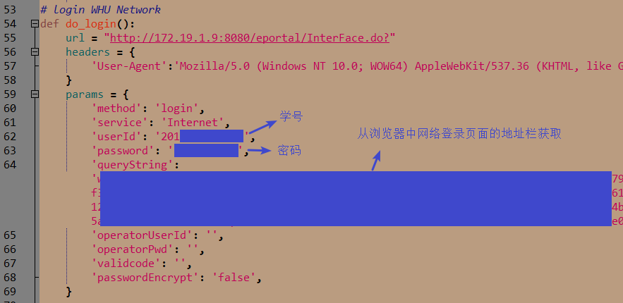
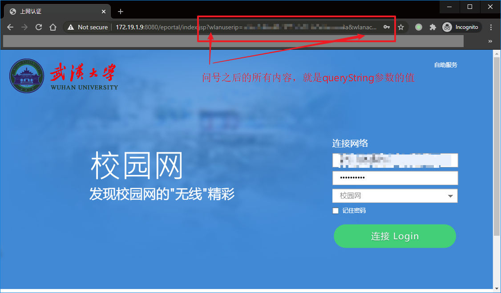
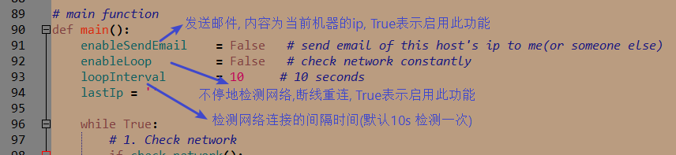
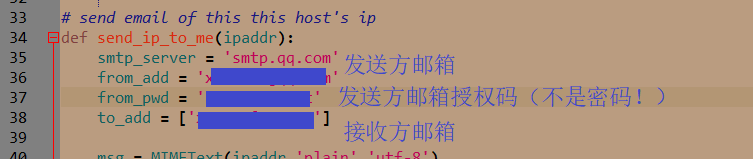
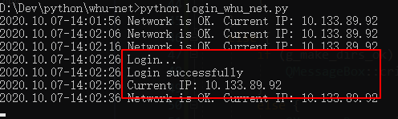

# WHU-Net-AutoLogin
武大校园网自动认证登录脚本，使用Python语言编写。

windows，linux，mac均可运行，有Python环境就行, 依赖`requests`库。

## 功能

+ 连接校园网
+ 发送本机IP到指定邮箱
+ 断线重连 （不停地检测网络是否连接，默认间隔10s）

## 基础使用

在`do_login()`函数中，设置自己地校园网账号（学号）和密码，以及参数`queryString`。



参数`queryString`，获取方法为如下：

+ 在浏览器中打开校园网登录页面，复制地址栏中`?`之后的所有内容。



## 发送邮件（从QQ邮箱发出） & 断线重连





授权码可以通过如下方式获取，很重要，妥善保管！


断线重连



## 开机启动

## 一、Linux

安装python3：`sudo apt install python3`

### 开机自动执行

`systemd`目录提供了`whu-net-login.service`服务脚本（修改里面的文件路径）。

将该`service`文件放到`/usr/lib/systemd/system`或者`/etc/systemd/system/`目录下。然后执行：

```sh
sudo systemctl daemon-reload	# 重新加载 systemd 程序的配置文件
sudo systemctl enable whu-net-login.service		# 加入开机启动项中

sudo reboot 	# 重启系统
```


## 二、Windows

### 1. 开机自动执行

新建一个bat脚本，写入

```
C:\python.exe "C:\whu_net_login.py"
```

只是个示例，自行修改相应的路径（绝对路径）。

另存为`start.bat`，放到以下两个目录的任何一个

+ C:\ProgramData\Microsoft\Windows\Start Menu\Programs\StartUp
+ %USERPROFILE%\AppData\Roaming\Microsoft\Windows\Start Menu\Programs\Startup

## 三、Mac

NULL